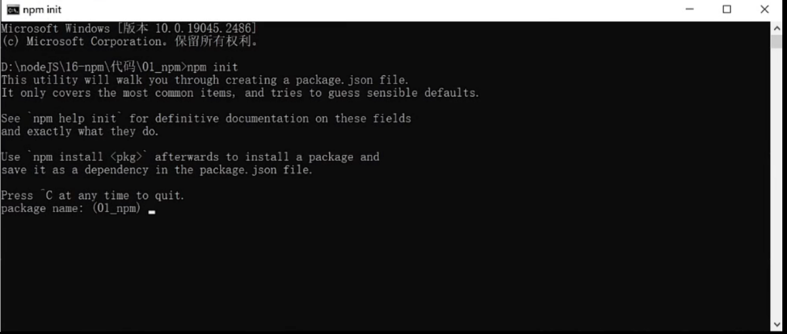
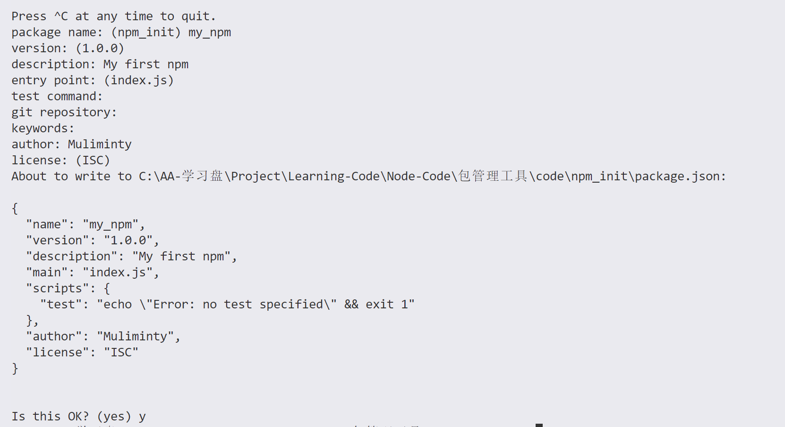
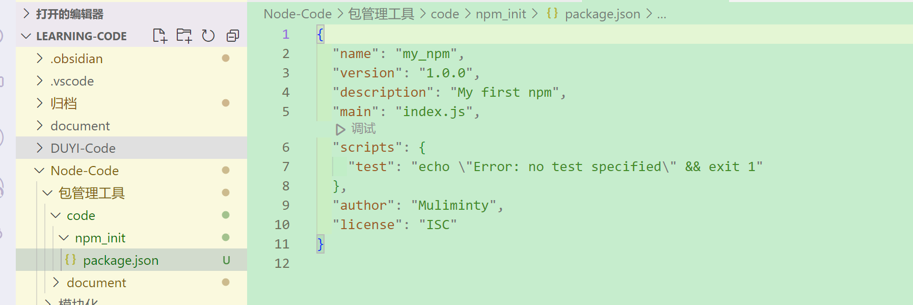
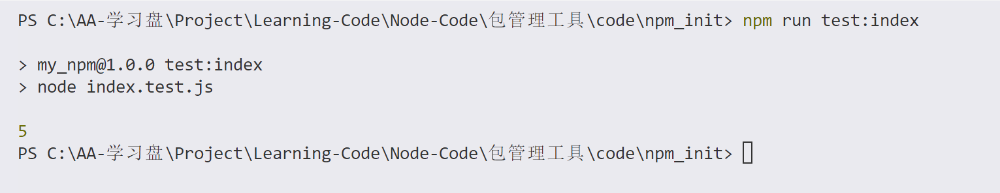
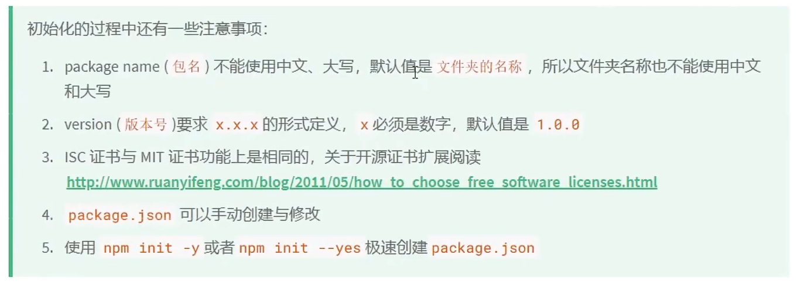

# 从零开始初始化一个npm包 - 详细步骤及注意事项

在本文档中，我们将详细介绍如何从零开始初始化一个npm包，并补充一些注意事项以确保您的npm包能够顺利发布和维护。



## 1. 初始化npm包的步骤

### 步骤一：创建新的文件夹

首先，在命令行中执行以下命令来创建一个新的文件夹并进入该文件夹：

```bash
mkdir my-npm-package
cd my-npm-package
```

### 步骤二：初始化npm包

使用以下命令初始化npm包，并按照提示填写相关信息：

```bash
npm init
```



这些字段分别代表以下意思：

- 包名称 (package name): 要发布的 npm 包的名称。
- 版本号 (version): 要发布的 npm 包的版本号。
- 描述 (description): 对 npm 包的简要描述。
- 入口点 (entry point): 指定 npm 包的入口文件，即在引用该包时将由 Node.js 加载的文件。
- 测试命令 (test command): 用于运行软件包测试的命令。
- Git 存储库 (git repository): 指定 npm 包的 Git 存储库的 URL。
- 关键字 (keywords): 与 npm 包相关的关键字，用于帮助其他开发人员找到和理解该包。
- 作者 (author): npm 包的作者信息。
- 许可证 (license): 指定 npm 包的许可证类型。

执行完成之后就会在当前文件夹创建一个`package.json` 文件 如下



### 步骤三：创建代码文件

在新的文件夹中创建一个`index.js`文件，并添加以下代码：

```javascript
function add(a, b) {
  return a + b;
}

module.exports = add;
```

### 步骤四：测试代码

创建一个`index.test.js`文件，并编写以下测试代码：

```javascript
const add = require('./index');

const result = add(2, 3);
console.log(result); // 应该输出 5
```

`package.json`的 `scripts` 补充如下代码 然后在终端执行 成功输出

```
  "scripts": {
    "test": "echo \"Error: no test specified\" && exit 1",
    "test:index": "node index.test.js"
  },
```



### 步骤五：发布npm包

注册npm账号后，使用以下命令登录并发布您的包：

```bash
npm login
npm publish
```

## 2. 补充注意事项



在初始化npm包的过程中，还有一些需要注意的事项。

### 包的命名规范

包名通常应当是小写字母，可以包含连字符或下划线，且不应当包含空格。

### 版本控制

遵循[语义化版本控制](https://semver.org/)规范，初始版本号可以是1.0.0。

### 依赖管理

将包依赖添加到`package.json`文件中，使用`npm install <package-name>`来安装这些依赖。

### 发布前的测试

进行充分的测试以确保包的功能正确，并使用各种测试框架（如Mocha、Jest等）来编写和运行测试用例。

### 发布后的维护

包括及时更新版本、处理用户反馈和问题、确保包的兼容性等。

希望这份详细的文档能够帮助您顺利地初始化并发布您的npm包！
