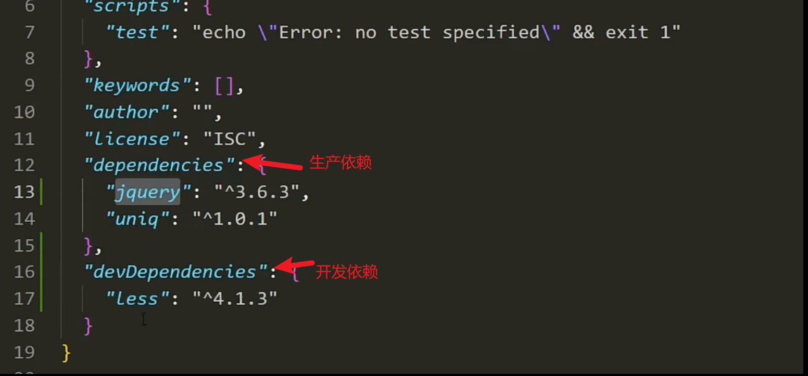

# 生产依赖和开发依赖

生产依赖和开发依赖是 npm 中常用的两种依赖关系，它们分别用于不同的环境和目的。以下是关于生产依赖和开发依赖的详细文档：

### 生产依赖

生产依赖是指在应用程序运行时需要的依赖项，这些依赖项包括应用程序的核心功能和运行时所需的模块。在 npm 中，生产依赖通常通过 `npm install` 安装，而且在部署和生产环境中会被使用。

在 `package.json` 文件中，生产依赖项会被记录在 `"dependencies"` 字段下。安装生产依赖时，可以使用 `npm install <package-name>` 或者 `npm install --save <package-name>` 命令。

### 开发依赖

开发依赖是指在开发过程中需要的依赖项，这些依赖项通常包括测试框架、构建工具、代码检查工具等只在开发环境下使用的模块。在 npm 中，开发依赖通常通过 `npm install` 加上 `--save-dev` 标志安装，而且在生产环境中不会被使用。

在 `package.json` 文件中，开发依赖项会被记录在 `"devDependencies"` 字段下。安装开发依赖时，可以使用 `npm install <package-name> --save-dev` 命令。

当你在`package.json`中定义了生产依赖和开发依赖后，可以使用以下命令来安装它们：

### 安装生产依赖

```bash
npm install <package-name>
```

或者

```bash
npm install --save <package-name>
```

### 安装开发依赖

```bash
npm install <package-name> --save-dev
```

安装后，生产依赖会被记录在 `package.json` 的 `"dependencies"` 字段下，而开发依赖会被记录在 `"devDependencies"` 字段下。这些依赖项可以通过 `npm install` 命令来安装，也可以在其他环境中通过 `npm ci` 命令来根据 `package-lock.json` 文件还原依赖。



### 参考文档

- [npm 文档 - npm install](https://docs.npmjs.com/cli/v7/commands/npm-install)
- [npm 文档 - package.json dependencies](https://docs.npmjs.com/cli/v7/configuring-npm/package-json#dependencies)
